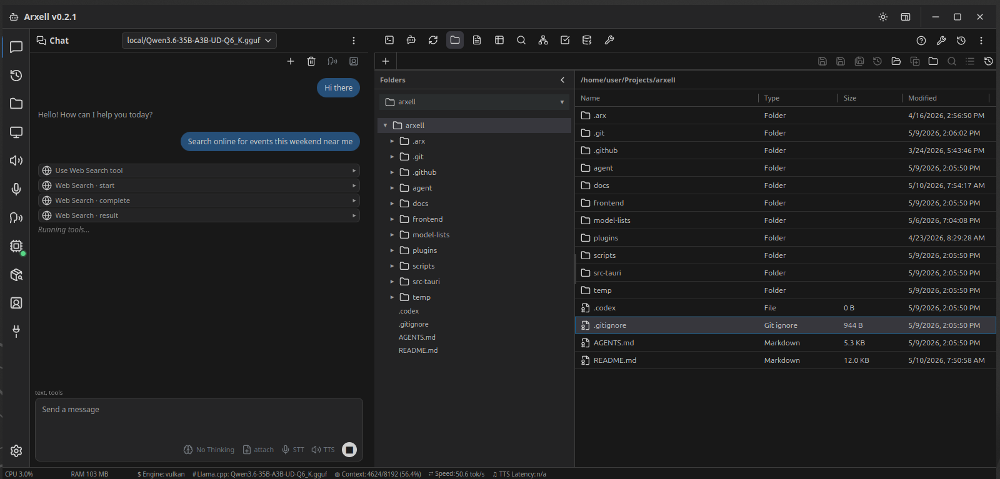

<p align="center">
  
</p>

<h1 align="center">Arxell</h1>

<p align="center">
  <strong>The private, fully-local AI workspace.</strong><br>
  Chat with any LLM. Run agents. Edit files. Talk out loud. All on your machine — zero telemetry, zero compromise.
</p>

<p align="center">
  
  
  
  
  
</p>

---

<p align="center">
  
</p>

---

## Why Arxell?

Arxell brings frontier AI performance into secure local infrastructure, letting teams run language, image, voice, and document intelligence on-prem or offline without sending sensitive data to third-party clouds. With Arxell everything stays on your hardware. Your API keys live in your OS keychain. Your conversations stay on your disk. Even your voice never leaves the app. Arxell is fully functional even when 100% offline.

<table>
  <tr>
    <td width="50%">
      <h3>&#x1F6E1;&#xFE0F; Zero Cloud</h3>
      <p>No analytics. No tracking pixels. No phone-home. The network is used only if and when <em>you</em> choose to optionally setup and call a cloud API provider.</p>
    </td>
    <td width="50%">
           <h3>&#x1F399;&#xFE0F; Full Voice Stack</h3>
      <p>Speech-to-text (Whisper), text-to-speech (Kokoro, Piper, Matcha, Kitten), and live VAD with duplex modes — all local.</p>
    </td>
  </tr>
  <tr>
    <td>
      <h3>&#x1F504; Multi-Agent Loops</h3>
      <p>Orchestrate Planner &rarr; Executor &rarr; Validator &rarr; Critic cycles with the built-in Looper tool for iterative, self-correcting workflows.</p>
    </td>
    <td>
       <h3>&#x1F5A5;&#xFE0F; Native Desktop</h3>
      <p>Built on <strong>Tauri 2</strong> (Rust + WebView) for a lean, fast, cross-platform experience. Small bundle. Low memory. No Electron.</p>
    </td>
  </tr>
  <tr>
    <td>
      <h3>&#x1F4BE; Local Model Inference</h3>
      <p>Download GGUF models from HuggingFace, run them through the bundled LLaMA runtime with GPU offload, context-size tuning, and sampling controls.</p>
    </td>
    <td>
      <h3>&#x1F510; OS-Keychain Secrets</h3>
      <p>API keys are stored in your operating system's credential manager. Plaintext fallback requires explicit acknowledgment.</p>
    </td>
  </tr>
</table>
...and much much more!
---

## Workspace Tools

Arxell ships with 11 built-in workspace tools — each one a full-featured panel in the UI, and several are also available as agent capabilities.

 
| | Tool | Description |
|---|------|-------------|
|  | **Terminal** | Full PTY shell sessions — bash, zsh, PowerShell. Run anything you'd run in a terminal, right inside the workspace. |
|  | **OpenCode** | An AI-powered coding agent embedded in your terminal. Ask it to write, refactor, debug, or explain code. |
|  | **Looper** | Multi-agent loop orchestration with Planner, Executor, Validator, and Critic phases. Run iterative build cycles with interactive checkpoints. |
|  | **Files** | Browse directories, read and edit files, create folders — all through a permission-checked filesystem interface. |
|  | **Notepad** | A tabbed text editor for workspace files and scratch buffers with syntax highlighting. |
|  | **Sheets** | A AI-powered spreadsheet editor. Open CSV, Json/L, and XLSX workbooks, leverage over 20 common formulars/functions, and save structured data. |
|  | **WebSearch** | Use Serper to Search the web and pull live context into your workspace. Route queries through your configured search API. |
|  | **Chart** | Render Mermaid flowcharts, sequence diagrams, and more — visualised directly in the workspace pane. |
|  | **Tasks** | Plan, track, and status-check work items. Works standalone or as an agent-accessible task board. |
|  | **Memory** | Persistent context references the agent can read and write across sessions. Long-term memory, local-first. |
|  | **Docs** | Browse and read documentation files without leaving the workspace. |

---

## Agent Skills

Eight specialised agent skills ship out of the box, giving the AI structured playbooks for complex software-engineering workflows:


| Skill | Purpose |
|-------|---------|
| **Core Orchestrator** | Top-level routing and task decomposition |
| **Planning & Specs** | Break features into actionable specifications |
| **Product Designer** | UX flows, wireframes, interaction patterns |
| **Frontend Engineer** | Component architecture, state, styling |
| **Backend Engineer** | APIs, data models, services |
| **Database Engineer** | Schema design, migrations, query optimisation |
| **Guardrails & Evals** | Quality checks, observability, safety |
| **Product Vision** | Strategic direction and roadmap thinking |

---

## Voice

Arxell includes a complete local voice stack — no cloud STT/TTS services required.

```
┌──────────────┐     ┌──────────────┐     ┌──────────────┐
│   Microphone  │────▶│  VAD Engine  │────▶│  STT (Whisper)│
│   (local)     │     │  (sherpa-onnx)│     │  (streaming)  │
└──────────────┘     └──────┬───────┘     └──────────────┘
                            │
                     duplex modes
                            │
┌──────────────┐     ┌──────┴───────┐     ┌──────────────┐
│   Speakers   │◀────│  TTS Engine  │◀────│  Agent Text   │
│   (local)    │     │ (Kokoro · Piper · Matcha · Kitten) │
└──────────────┘     └──────────────────────┘──────────────┘
```

- **Speech-to-Text** — Whisper-compatible streaming transcription
- **Text-to-Speech** — Four engine options (Kokoro, Piper, Matcha, Kitten) with voice selection and speed control
- **Voice Activity Detection** — Multi-VAD architecture with live handoff, shadow evaluation, and speculative decoding
- **Duplex Modes** — Single-turn, full-duplex speculative, and shadow-only diagnostic modes

---

## Architecture

Arxell follows a strict layered architecture where dependencies flow in one direction only:

```
┌─────────────────────────────────────────────────┐
│                  Frontend (TS)                   │
│           Rendering & user interaction           │
├─────────────────────────────────────────────────┤
│              IPC Command Layer (Rust)            │
│          Thin payload translation only           │
├─────────────────────────────────────────────────┤
│           Application Services (Rust)            │
│      Orchestration, state machines, agent        │
├─────────────────────────────────────────────────┤
│             Tool & Agent Registries              │
│          Dispatch, policy, enablement            │
├─────────────────────────────────────────────────┤
│           Tool Modules & Memory (Rust)           │
│        Side effects, platform specifics          │
└─────────────────────────────────────────────────┘
         ▲ No upward dependencies allowed ▲
```

Every layer communicates through typed contracts with correlation IDs, structured events, and explicit error propagation. Secrets never appear in event payloads. Tools never call other tools directly.

---

## Tech Stack

| Layer | Technology |
|-------|-----------|
| Desktop shell | **Tauri 2** (Rust backend + system WebView) |
| Frontend | **TypeScript**, **Vite**, **React 18** |
| Terminal | **xterm.js** with PTY binding |
| Charts | **Mermaid 11** |
| Spreadsheets | **IronCalc** |
| STT | **Whisper** (streaming) |
| TTS | **sherpa-onnx** (Kokoro · Piper · Matcha · Kitten) |
| Local inference | **llama.cpp** runtime (bundled) |
| Secret storage | **OS keychain** via `keyring` crate |
| Database | **SQLite** via `rusqlite` |

---

## Privacy Commitment

> **Arxell collects nothing. Not now. Not ever.**

- No analytics, telemetry, or crash reporting
- No accounts, sign-ups, or cloud sync
- API keys stored exclusively in your OS credential manager
- All conversations, files, and voice data remain on your local disk
- The only network traffic is LLM API calls **you** initiate
- Plugin tools run in sandboxed iframes with capability gating

---

## Getting Started

### Prerequisites

- [Rust](https://rustup.rs/) (latest stable)
- [Node.js](https://nodejs.org/) >= 18
- Platform-specific WebView2 (Windows) / WebKit (macOS &mdash; built-in) / webkit2gtk (Linux)

### Build from Source

```bash
# Clone the repository
git clone https://github.com/arxellinc/arxell.git
cd arxell

# Install frontend dependencies
cd frontend && npm install && cd ..

# Run in development mode
cd src-tauri && cargo tauri dev

# Or build a production bundle
cd src-tauri && cargo tauri build
```

### Connect an LLM

1. Open **Settings &rarr; API Connections**
2. Add a provider (OpenAI, Anthropic, local server, etc.)
3. Your API key is stored in your OS keychain automatically
4. Start chatting

### Run a Local Model

1. Open the **Model Manager** (sidebar)
2. Browse the Unsloth Dynamic Quants catalog (auto-updated from HuggingFace)
3. Download a GGUF model
4. Configure the LLaMA runtime (context size, GPU layers)
5. Start inference — no API key needed

---

## Project Structure

```
arxell/
├── frontend/            # TypeScript frontend (Vite + React)
│   └── src/tools/       # Workspace tool modules
├── src-tauri/           # Rust backend (Tauri 2)
│   ├── src/app/         # Application services
│   ├── src/agent_tools/ # Agent-facing tool implementations
│   ├── src/skills/      # Agent skill playbooks
│   ├── src/stt/         # Speech-to-text subsystem
│   ├── src/tts/         # Text-to-speech subsystem
│   └── resources/       # Bundled runtimes (llama.cpp, Kokoro, Whisper)
├── agent/               # arx-rs agent library
├── docs/                # Architecture & design documents
├── model-lists/         # Bundled model catalog CSVs
├── plugins/             # Plugin tool extensions
└── scripts/             # Build & sync utilities
```

---

<p align="center">
  
</p>

<p align="center">
  <strong>Arxell</strong> &mdash; AI that respects your privacy.<br>
  Built with &#x2764;&#xFE0F; and Rust.
</p>
