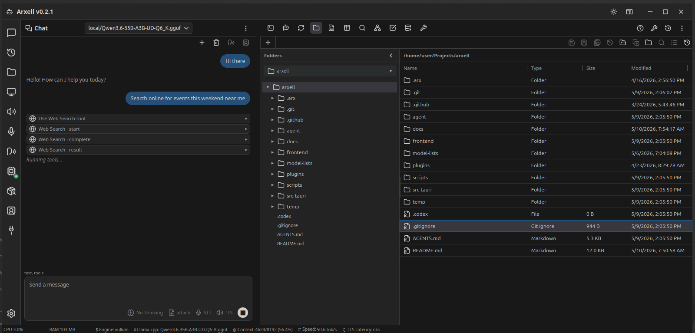

<p align="center">
  
</p>

<h1 align="center">Arxell</h1>

<p align="center">
  <strong>The private, fully-local AI workspace.</strong><br>
  Chat with any LLM. Run agents. Edit files. Talk out loud. All on your machine — zero telemetry, zero compromise.
</p>

<p align="center">
  
  
  
  
  
</p>

---

<p align="center">
  
</p>

---

## Why Arxell?

Arxell brings AI workflows into secure local infrastructure, letting teams run language, voice, and document intelligence on-prem or offline. Local workflows stay on your hardware. If you explicitly configure a cloud provider, only the requests you initiate are sent to that provider. API keys use your OS keychain by default, conversations are stored locally, and the voice stack can run without a cloud service.

<table>
  <tr>
    <td width="50%">
      <h3>&#x1F6E1;&#xFE0F; Zero Cloud</h3>
      <p>No analytics. No tracking pixels. No phone-home. The network is used only if and when <em>you</em> choose to optionally setup and call a cloud API provider.</p>
    </td>
    <td width="50%">
           <h3>&#x1F399;&#xFE0F; Full Voice Stack</h3>
      <p>Speech-to-text (Whisper), text-to-speech (Kokoro, Piper, Matcha, Kitten), and live VAD with duplex modes — all local.</p>
    </td>
  </tr>
  <tr>
    <td>
      <h3>&#x1F504; Multi-Agent Loops</h3>
      <p>Orchestrate Planner &rarr; Executor &rarr; Validator &rarr; Critic cycles with the built-in Looper tool for iterative, self-correcting workflows.</p>
    </td>
    <td>
       <h3>&#x1F5A5;&#xFE0F; Native Desktop</h3>
      <p>Built on <strong>Tauri 2</strong> (Rust + WebView) for a lean, fast, cross-platform experience. Small bundle. Low memory. No Electron.</p>
    </td>
  </tr>
  <tr>
    <td>
      <h3>&#x1F4BE; Local Model Inference</h3>
      <p>Download GGUF models from HuggingFace, run them through the bundled LLaMA runtime with GPU offload, context-size tuning, and sampling controls.</p>
    </td>
    <td>
      <h3>&#x1F510; OS-Keychain Secrets</h3>
      <p>API keys are stored in your operating system's credential manager. Plaintext fallback requires explicit acknowledgment.</p>
    </td>
  </tr>
</table>
...and much much more!
---

## Workspace Tools

Arxell ships with 11 built-in workspace tools — each one a full-featured panel in the UI, and several are also available as agent capabilities.

 
| | Tool | Description |
|---|------|-------------|
|  | **Terminal** | Full PTY shell sessions — bash, zsh, PowerShell. Run anything you'd run in a terminal, right inside the workspace. |
|  | **Pi** | Interactive [Pi coding harness](https://pi.dev/) sessions embedded in terminal tabs, with independent working directories and optional initial prompts. |
|  | **Looper** | Planner → Executor → Validator → Critic automation powered by isolated Pi RPC processes, structured progress, policy checks, and interactive approvals. |
|  | **Files** | Browse directories, read and edit files, create folders — all through a permission-checked filesystem interface. |
|  | **Notepad** | A tabbed text editor for workspace files and scratch buffers with syntax highlighting. |
|  | **Sheets** | An AI-powered spreadsheet editor. Open CSV, JSONL, and XLSX workbooks, use common formulas and functions, and save structured data. |
|  | **WebSearch** | Use Serper to Search the web and pull live context into your workspace. Route queries through your configured search API. |
|  | **Chart** | Render Mermaid flowcharts, sequence diagrams, and more — visualised directly in the workspace pane. |
|  | **Tasks** | Draft, approve, schedule, and track durable work. Approved low-risk agent tasks delegate to Pi-backed Looper runs with history and notifications. |
|  | **Memory** | Persistent context references the agent can read and write across sessions. Long-term memory, local-first. |
|  | **Docs** | Browse and read documentation files without leaving the workspace. |

See [Pi Coding Harness](docs/PI_CODING_HARNESS.md) for supported versions, installation, authentication, privacy, trust, and automation policy details.

---

## Agent Skills

Eight specialised agent skills ship out of the box, giving the AI structured playbooks for complex software-engineering workflows:


| Skill | Purpose |
|-------|---------|
| **Core Orchestrator** | Top-level routing and task decomposition |
| **Planning & Specs** | Break features into actionable specifications |
| **Product Designer** | UX flows, wireframes, interaction patterns |
| **Frontend Engineer** | Component architecture, state, styling |
| **Backend Engineer** | APIs, data models, services |
| **Database Engineer** | Schema design, migrations, query optimisation |
| **Guardrails & Evals** | Quality checks, observability, safety |
| **Product Vision** | Strategic direction and roadmap thinking |

---

## Voice

Arxell includes a complete local voice stack — no cloud STT/TTS services required.

```
┌──────────────┐     ┌──────────────┐     ┌──────────────┐
│   Microphone  │────▶│  VAD Engine  │────▶│  STT (Whisper)│
│   (local)     │     │  (sherpa-onnx)│     │  (streaming)  │
└──────────────┘     └──────┬───────┘     └──────────────┘
                            │
                     duplex modes
                            │
┌──────────────┐     ┌──────┴───────┐     ┌──────────────┐
│   Speakers   │◀────│  TTS Engine  │◀────│  Agent Text   │
│   (local)    │     │ (Kokoro · Piper · Matcha · Kitten) │
└──────────────┘     └──────────────────────┘──────────────┘
```

- **Speech-to-Text** — Whisper-compatible streaming transcription
- **Text-to-Speech** — Four engine options (Kokoro, Piper, Matcha, Kitten) with voice selection and speed control
- **Voice Activity Detection** — Multi-VAD architecture with live handoff, shadow evaluation, and speculative decoding
- **Duplex Modes** — Single-turn, full-duplex speculative, and shadow-only diagnostic modes

---

## Architecture

Arxell follows a strict layered architecture where dependencies flow in one direction only:

```
┌─────────────────────────────────────────────────┐
│                  Frontend (TS)                   │
│           Rendering & user interaction           │
├─────────────────────────────────────────────────┤
│              IPC Command Layer (Rust)            │
│          Thin payload translation only           │
├─────────────────────────────────────────────────┤
│           Application Services (Rust)            │
│      Orchestration, state machines, agent        │
├─────────────────────────────────────────────────┤
│             Tool & Agent Registries              │
│          Dispatch, policy, enablement            │
├─────────────────────────────────────────────────┤
│           Tool Modules & Memory (Rust)           │
│        Side effects, platform specifics          │
└─────────────────────────────────────────────────┘
         ▲ No upward dependencies allowed ▲
```

Every layer communicates through typed contracts with correlation IDs, structured events, and explicit error propagation. Secrets never appear in event payloads. Tools never call other tools directly.

---

## Tech Stack

| Layer | Technology |
|-------|-----------|
| Desktop shell | **Tauri 2** (Rust backend + system WebView) |
| Frontend | **TypeScript**, **Vite**, **React 18** |
| Terminal | **xterm.js** with PTY binding |
| Charts | **Mermaid 11** |
| Spreadsheets | **IronCalc** |
| STT | **Whisper** (streaming) |
| TTS | **sherpa-onnx** (Kokoro · Piper · Matcha · Kitten) |
| Local inference | **llama.cpp** runtime (bundled) |
| Coding harness | **Pi 0.81.x** — interactive TUI and headless JSONL RPC |
| Secret storage | **OS keychain** via `keyring`; explicitly acknowledged fallback when unavailable |
| Database | **SQLite** via `rusqlite` |

---

## Privacy Commitment

> **Arxell collects nothing. Not now. Not ever.**

- No analytics, telemetry, or crash reporting
- No accounts, sign-ups, or cloud sync
- API keys stored in your OS credential manager by default; plaintext fallback requires explicit acknowledgment
- Conversations, files, and voice data remain local unless you explicitly send context to a configured cloud provider
- The only provider traffic is generated by chat or agent runs **you** initiate
- Automated Pi runs use an explicit project-boundary policy, protected-path checks, and fail-closed destructive-action approval
- The Pi policy is defense in depth; Pi runs with Arxell's OS permissions and is not an operating-system sandbox

---

## Getting Started

### Prerequisites

- [Rust](https://rustup.rs/) (latest stable)
- [Node.js](https://nodejs.org/) >= 20.19 for frontend tooling
- Platform-specific WebView2 (Windows) / WebKit (macOS &mdash; built-in) / webkit2gtk (Linux)
- For the **Pi** workspace tool, **Looper**, and approved chat execution: Pi `>=0.81.0,<0.82.0` and Node.js >= 22.19
- On Windows, Pi also requires Git for Windows/Bash

Install the supported Pi release with lifecycle scripts disabled:

```bash
npm install -g --ignore-scripts @earendil-works/pi-coding-agent@0.81.1
```

Pi is an external system dependency in this release. Arxell discovers explicit, managed, PATH, npm, pnpm, Yarn, and Bun installations and reports actionable setup diagnostics. See [Pi Coding Harness](docs/PI_CODING_HARNESS.md).

Linux package notes:
- `.deb` packages declare required GTK/WebKit runtime dependencies so supported Debian/Ubuntu systems install them automatically.
- `AppImage` still relies on host desktop runtime libraries (notably GTK/WebKit). Prefer `.deb` on Debian/Ubuntu for the most reliable out-of-box install.
- `Flatpak` is the recommended cross-distro Linux install format for the most consistent runtime behavior.
- If an AppImage opens to a blank window, run `./scripts/check-appimage-runtime.sh` to validate host runtime libraries.

### Build from Source

```bash
# Clone the repository
git clone https://github.com/arxellinc/arxell.git
cd arxell

# Install frontend dependencies
cd frontend && npm install && cd ..

# Run in development mode
cd src-tauri && cargo tauri dev

# Or build a production bundle
cd src-tauri && cargo tauri build
```

### Connect an LLM

1. Open **Settings &rarr; API Connections**
2. Add a provider (OpenAI, Anthropic, local server, etc.)
3. Your API key is stored through Arxell's secret-storage layer (the OS keychain by default)
4. Start chatting or select the connection for a Pi-backed Looper run

Portable connection exports contain metadata only; credentials must be re-entered after import.

### Run a Local Model

1. Open the **Model Manager** (sidebar)
2. Browse catalog (Unsloth UD Quants auto-updated from HuggingFace, more to come)
3. Download a GGUF model
4. Configure the LLaMA runtime (context size, GPU layers)
5. Start inference — no API key needed

---

## Project Structure

```
arxell/
├── frontend/            # TypeScript frontend (Vite + React)
│   └── src/tools/       # Workspace tool modules
├── src-tauri/           # Rust backend (Tauri 2)
│   ├── src/app/         # Application services
│   ├── src/agent_tools/ # Agent-facing tool implementations
│   ├── src/skills/      # Agent skill playbooks
│   ├── src/stt/         # Speech-to-text subsystem
│   ├── src/tts/         # Text-to-speech subsystem
│   └── resources/       # Bundled runtimes, Pi policy extension, and notices
├── agent/               # arx-rs agent library
├── docs/                # Architecture & design documents
├── model-lists/         # Bundled model catalog CSVs
├── plugins/             # Plugin tool extensions
└── scripts/             # Build & sync utilities
```

---

<p align="center">
  
</p>

<p align="center">
  <strong>Arxell</strong> &mdash; AI that respects your privacy.<br>
  Built with &#x2764;&#xFE0F; and Rust.
</p>
