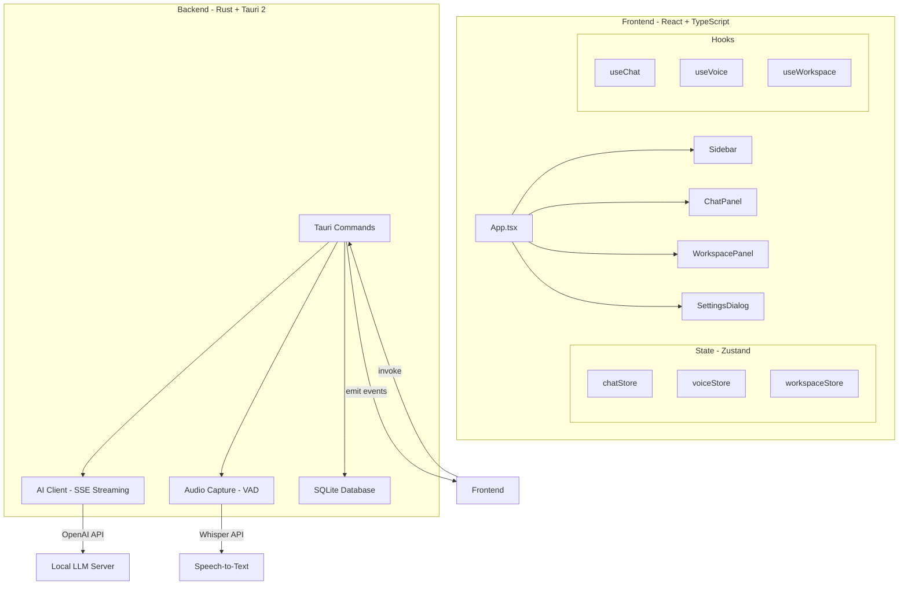
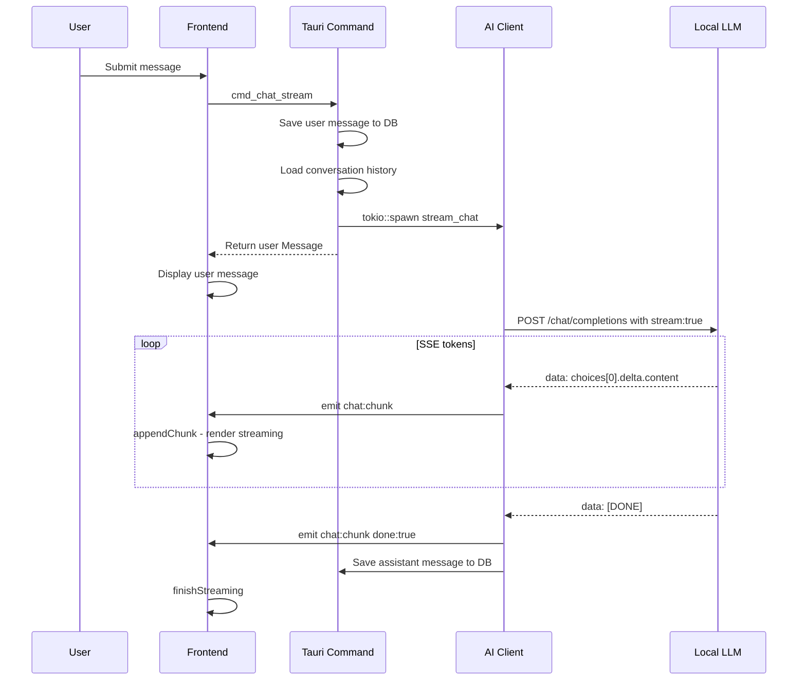
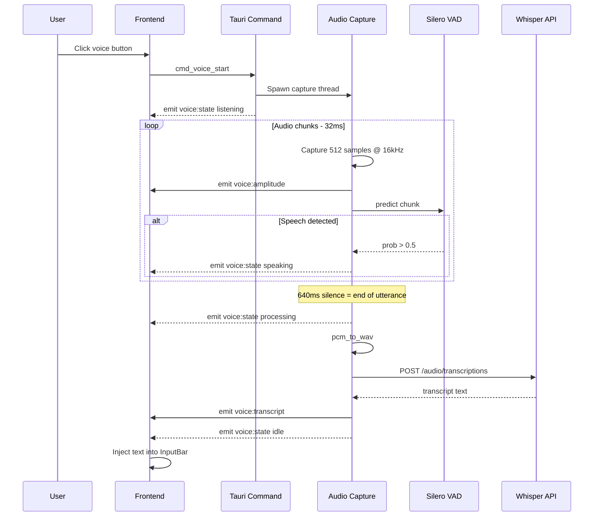

# arx v0.8 — Agent Onboarding Guide

## What this is

**arx** is a local-first AI chat desktop application built with **Rust + Tauri 2** (backend) and **React 18 + TypeScript + Vite** (frontend). It targets OpenAI-compatible local model servers (LM Studio default, also works with Ollama). All data is stored in SQLite on-device. There is no remote backend.

### Key Features

- **Local-first**: All data stored in SQLite on device
- **AI Chat**: Streaming chat completions via OpenAI-compatible APIs
- **Voice Input**: Real-time voice activity detection (VAD) with Silero ONNX model, transcription via Whisper-compatible endpoints
- **Workspace Panel**: Built-in code editor with Monaco, diff viewer, and markdown preview
- **Skills System**: Extensible markdown-based skill files for customizing AI behavior
- **Multi-project Support**: Organize conversations into projects with workspace paths
- **Three-panel Layout**: Resizable sidebar, chat panel, and workspace panel

---

## Quick Start

### Prerequisites

- **Node.js** 18+ and npm
- **Rust** 1.70+ with cargo
- **Tauri 2 CLI**: `npm install -g @tauri-apps/cli@2`
- A local LLM server (LM Studio or Ollama) running on port 1234 or other

### Development

```bash
# Install dependencies
npm install

# Run in development mode (hot reload)
npm run tauri dev

# Build release
npm run tauri build
```

### First Run

1. Start your local LLM server (e.g., LM Studio on port 1234)
2. Launch arx
3. Create a project using the "+" button in the sidebar
4. Start chatting!

---

## Architecture Overview



---

## Project Structure

```
arx v0.8/
├── src-tauri/              Rust backend (Tauri 2)
│   ├── Cargo.toml          Rust dependencies
│   ├── tauri.conf.json     Tauri configuration
│   ├── capabilities/       Tauri 2 security capabilities
│   └── src/
│       ├── main.rs         Entry point - calls lib.rs::run
│       ├── lib.rs          AppState, Tauri builder, plugin init, command registration
│       ├── db/
│       │   ├── mod.rs      SQLite init with WAL, foreign_keys, schema + default seeds
│       │   └── models.rs   Project, Conversation, Message structs + from_row
│       ├── ai/
│       │   ├── client.rs   AiClient: stream_chat SSE, transcribe_audio multipart
│       │   └── types.rs    ChatMessage, ChatRequest, StreamChunk, ChunkEvent
│       ├── audio/
│       │   ├── capture.rs  cpal audio capture, VAD loop, pcm_to_wav
│       │   └── vad.rs      SileroVad: tract-onnx ONNX model, 512-sample predict
│       └── commands/
│           ├── chat.rs     cmd_chat_stream, cmd_chat_get_messages, cmd_chat_clear
│           ├── project.rs  cmd_project_*, cmd_conversation_*
│           ├── settings.rs cmd_settings_get/set/get_all, cmd_models_list
│           ├── skills.rs   cmd_skills_list, cmd_skills_dir, seed_default_skills
│           ├── voice.rs    cmd_voice_start, cmd_voice_stop
│           └── workspace.rs cmd_workspace_read/write/list_dir/create/delete
├── src/                    React frontend
│   ├── main.tsx            ReactDOM.createRoot, loading screen dismiss
│   ├── App.tsx             Root layout: ResizeDivider, 3-panel flex
│   ├── index.css           Tailwind v4 import, dark scrollbars, prose tweaks
│   ├── types/index.ts      All shared TS interfaces
│   ├── lib/
│   │   ├── tauri.ts        Typed invoke wrappers for every Tauri command
│   │   └── utils.ts        cn, getLanguageFromPath, formatDate, truncate
│   ├── store/
│   │   ├── chatStore.ts    Zustand: projects/convos/messages/streaming state
│   │   ├── voiceStore.ts   Zustand: VoiceState, amplitude, transcript
│   │   └── workspaceStore.ts Zustand: tabs, activeTabPath, view, diffState
│   ├── hooks/
│   │   ├── useChat.ts      useChatInit, useChatStream, useLoadMessages
│   │   ├── useVoice.ts     useVoiceControls, useVoiceEvents
│   │   └── useWorkspace.ts openFile, saveFile, listDir, showDiff
│   └── components/
│       ├── Sidebar/index.tsx        Left panel: project list + conversation list
│       ├── Chat/
│       │   ├── index.tsx            Center panel shell
│       │   ├── MessageList.tsx      Scrollable messages + streaming bubble
│       │   ├── MessageItem.tsx      Markdown + syntax highlight + copy button
│       │   ├── InputBar.tsx         Auto-resize textarea, voice button
│       │   ├── VoiceIndicator.tsx   VAD state indicator above input
│       │   └── SkillsBar.tsx        Skill pills + refresh/new buttons
│       ├── Workspace/
│       │   ├── index.tsx            Right panel: tabs, toolbar, editor routing
│       │   ├── CodeEditor.tsx       Monaco editor, Ctrl+S save, wordWrap prop
│       │   ├── DiffViewer.tsx       Monaco DiffEditor
│       │   ├── FileTree.tsx         Recursive fs tree
│       │   └── MarkdownPreview.tsx  react-markdown preview
│       └── SettingsDialog.tsx       Modal: all settings + model dropdown
├── .cargo/config.toml      Build env: PKG_CONFIG_PATH + rustflags for lib stubs
├── index.html              Dark loading spinner - pure CSS, no flash
├── package.json            npm dependencies and scripts
├── vite.config.ts          Vite configuration
└── agents.md               This file
```

---

## Three-panel Layout

```
┌──────────────┬─────────────────────────┬──────────────────────────────┐
│  Sidebar     │  Chat Panel             │  Workspace Panel             │
│  w: 224px*   │  flex-1                 │  w: 520px*                   │
│              │                         │ ┌───┬──────────────────────┐ │
│  Projects    │  Header                 │ │   │ Tab bar - always on  │ │
│  └ Convos    │  MessageList            │ │ I │ Toolbar: Open Save   │ │
│              │  VoiceIndicator         │ │ c │   Wrap  breadcrumb   │ │
│              │  SkillsBar - pills      │ │ o │                      │ │
│              │  InputBar               │ │ n │  Monaco / Markdown   │ │
│              │                         │ │   │  DiffViewer          │ │
└──────────────┴─────────────────────────┴───┴──────────────────────────┘
    ↕ drag                ↕ drag
```

* Widths are state-managed in `App.tsx`. Both dividers are draggable using `ResizeDivider` component with `setPointerCapture`. Sidebar: 160–420px, Workspace: 320–960px.

---

## TypeScript Interfaces

All shared types are defined in [`src/types/index.ts`](src/types/index.ts):

```typescript
// Core data models - mirror Rust structs
interface Project {
  id: string;
  name: string;
  description: string;
  workspace_path: string;
  created_at: number;    // Unix millis
  updated_at: number;
}

interface Conversation {
  id: string;
  project_id: string;
  title: string;
  model: string;
  created_at: number;
  updated_at: number;
}

interface Message {
  id: string;
  conversation_id: string;
  role: "user" | "assistant" | "system";
  content: string;
  created_at: number;
}

// Event payloads from backend
interface ChunkEvent {
  id: string;
  delta: string;
  done: boolean;
}

interface VoiceStateEvent {
  state: "idle" | "listening" | "speaking" | "processing";
}

interface AmplitudeEvent {
  level: number;  // 0.0-1.0 RMS amplitude
}

interface TranscriptEvent {
  text: string;
}

// Workspace types
interface FileEntry {
  name: string;
  path: string;
  is_dir: boolean;
  size: number;
}

interface OpenTab {
  path: string;
  name: string;
  content: string;
  language: string;
  modified: boolean;
}

type VoiceState = "idle" | "listening" | "speaking" | "processing";
```

---

## Data Model

### SQLite Tables

Defined in [`src-tauri/src/db/mod.rs`](src-tauri/src/db/mod.rs):

```sql
projects       (id, name, description, workspace_path, created_at, updated_at)
conversations  (id, project_id, title, model, created_at, updated_at)
messages       (id, conversation_id, role, content, created_at)
settings       (key, value)  -- key-value store
```

**Default settings** inserted on first run:
| key | default value |
|---|---|
| `base_url` | `http://127.0.0.1:1234/v1` |
| `api_key` | `lm-studio` |
| `model` | `zai-org/glm-4.6v-flash` |
| `stt_url` | `http://127.0.0.1:1234/v1/audio/transcriptions` |
| `system_prompt` | `You are arx, a helpful AI assistant. Be concise and clear.` |

All timestamps are Unix millis (`i64`). All IDs are UUID v4 strings.

### Skills - `{app_data_dir}/skills/*.md`

Skills are plain Markdown files stored outside the DB. On startup `seed_default_skills()` writes four starter files if absent: `code-review.md`, `document-writer.md`, `refactor.md`, `test-writer.md`. The `# Heading` becomes the display name; the first paragraph is the tooltip description.

---

## Tauri Commands Reference

All commands are registered in [`src-tauri/src/lib.rs`](src-tauri/src/lib.rs:43) `invoke_handler!`. Frontend wrappers are in [`src/lib/tauri.ts`](src/lib/tauri.ts).

### Chat Commands
| Command | Signature | Notes |
|---|---|---|
| `cmd_chat_stream` | `(conversation_id, content) → Message` | Saves user msg, starts tokio::spawn SSE stream, returns user Message immediately. Assistant response arrives via events. |
| `cmd_chat_get_messages` | `(conversation_id) → Vec<Message>` | Load full history ordered by `created_at` |
| `cmd_chat_clear` | `(conversation_id) → ()` | Delete all messages in conversation |

### Project & Conversation Commands
| Command | Notes |
|---|---|
| `cmd_project_create(name, workspace_path)` | Returns `Project` |
| `cmd_project_list()` | Ordered by `updated_at DESC` |
| `cmd_project_delete(id)` | Cascades to conversations + messages |
| `cmd_conversation_create(project_id, title)` | Returns `Conversation` |
| `cmd_conversation_list(project_id)` | Ordered by `updated_at DESC` |
| `cmd_conversation_delete(id)` | Cascades to messages |
| `cmd_conversation_update_title(id, title)` | Also updates `updated_at` |

### Settings Commands
| Command | Notes |
|---|---|
| `cmd_settings_get(key)` | Returns `Option<String>` |
| `cmd_settings_set(key, value)` | `INSERT OR REPLACE` |
| `cmd_settings_get_all()` | Returns `HashMap<String,String>` |
| `cmd_models_list()` | **async** — `GET {base_url}/models` → parses `data[].id`, returns `Vec<String>` |

### Skills Commands
| Command | Notes |
|---|---|
| `cmd_skills_list()` | Reads `{app_data_dir}/skills/*.md`, parses name+description, returns `Vec<SkillMeta>` sorted by name |
| `cmd_skills_dir()` | Returns path string to skills dir for frontend to create new files |

### Voice Commands
| Command | Notes |
|---|---|
| `cmd_voice_start()` | Loads Silero VAD model from `resources/silero_vad.onnx`, spawns OS thread for capture+VAD loop |
| `cmd_voice_stop()` | Sets `voice_active=false`, emits `voice:state idle` |

### Workspace Commands
| Command | Notes |
|---|---|
| `cmd_workspace_read_file(path)` | Returns `String` |
| `cmd_workspace_write_file(path, content)` | Creates parents if needed |
| `cmd_workspace_list_dir(path)` | Returns `Vec<FileEntry>` |
| `cmd_workspace_create_file(path)` | Creates empty file |
| `cmd_workspace_delete_path(path)` | Deletes file or dir |

---

## Tauri Events Reference

| Event | Payload type | Emitted by | Description |
|---|---|---|---|
| `chat:chunk` | `ChunkEvent {id, delta, done}` | `ai/client.rs` | SSE token stream. `done:true` = end of response |
| `chat:error` | `{message: string}` | `commands/chat.rs` | Stream or API error |
| `voice:state` | `{state: "idle"\|"listening"\|"speaking"\|"processing"}` | `audio/capture.rs`, `commands/voice.rs` | VAD state machine transitions |
| `voice:transcript` | `{text: string}` | `commands/voice.rs` | Final Whisper transcription result |
| `voice:amplitude` | `{level: f32}` | `audio/capture.rs` | RMS amplitude per 32ms frame for visualizer |

Frontend listens via `@tauri-apps/api/event`'s `listen()`. All event listeners set up in hooks ([`useChat.ts`](src/hooks/useChat.ts), [`useVoice.ts`](src/hooks/useVoice.ts)) which are called from component trees.

---

## AI Streaming Pipeline



---

## Voice Pipeline



---

## AppState - Rust Shared State

```rust
pub struct AppState {
    pub db: Mutex<rusqlite::Connection>,   // single shared SQLite connection
    pub voice_active: Mutex<bool>,          // prevents double-start of capture
    pub audio_buffer: Mutex<Vec<f32>>,      // PCM from capture → transcription handoff
}
```

Only one SQLite connection is used across all commands (protected by `Mutex`). Commands lock it briefly for queries and release immediately. **Never hold the DB lock across an `.await`** — doing so will deadlock since the `Mutex` is not async-aware.

---

## Frontend State Management

### Zustand Stores

**`chatStore`** — source of truth for the chat UI:
- `projects[]`, `conversations[]`, `messages[]`
- `activeProjectId`, `activeConversationId`
- `streamingMessage: {id, content, conversation_id} | null` — the live assistant bubble
- `isStreaming: boolean`
- Key actions: `startStreaming(id, convId)`, `appendChunk(id, delta)`, `finishStreaming()`

**`voiceStore`**:
- `state: VoiceState` (`idle|listening|speaking|processing`)
- `amplitude: number`
- `transcript: string | null`

**`workspaceStore`**:
- `tabs: OpenTab[]` — all open files `{path, name, content, language, modified}`
- `activeTabPath: string | null`
- `view: "editor"|"diff"|"markdown"`
- `diffState: {original, modified, language, title} | null`
- Key actions: `openTab`, `closeTab`, `setActiveTab`, `updateTabContent`, `markTabModified`, `setDiff`

### Hook Responsibilities

| Hook | Responsibility |
|---|---|
| `useChatInit` | Loads project list on mount |
| `useLoadMessages` | Loads messages when `activeConversationId` changes |
| `useChatStream` | Sets up `chat:chunk` listener; returns `sendMessage()` |
| `useVoiceControls` | `toggleVoice()`, `isActive` |
| `useVoiceEvents(onTranscript)` | Listens to `voice:state`, `voice:amplitude`, `voice:transcript` |
| `useWorkspace` | `openFile(path)`, `saveFile(path, content)`, `listDir(path)`, `showDiff(...)` |

---

## Skills System

Skills are Markdown instruction files that configure agent behaviour. They live in `{app_data_dir}/skills/`. The app seeds 4 defaults on startup.

**File format:**
```markdown
# Skill Name

First paragraph is shown as description/tooltip in the UI.

Full skill instructions follow...
```

**Frontend flow:**
1. `SkillsBar` component (bottom of Chat panel) calls `cmd_skills_list` on mount
2. Each skill appears as a pill button
3. Clicking calls `openFile(skill.path)` → opens the `.md` file in the Workspace editor
4. User edits and saves directly — changes take effect on next `cmd_skills_list` refresh
5. "+" button creates a blank skill file via `cmd_skills_dir` + `workspaceWriteFile`, then opens it

The skills system is intentionally minimal — no runtime injection into prompts yet. Skills are human-readable instruction sets that can be referenced manually in chat or wired into the system prompt in the future.

---

## Workspace Editor

### Toolbar

Located in [`Workspace/index.tsx`](src/components/Workspace/index.tsx) between the tab bar and Monaco:

| Button | Action |
|---|---|
| **Open** | Native OS file picker via `@tauri-apps/plugin-dialog` `open()` → `openFile(path)` |
| **Save** | `saveFile(activeTab.path, activeTab.content)` — lights up indigo when tab is `modified` |
| **Wrap** | Toggles Monaco `wordWrap: "on"/"off"` via local state → `CodeEditor wordWrap` prop |
| Breadcrumb | Shows `parent/filename` of active tab (right-aligned, truncated) |

### Keyboard Shortcuts

| Shortcut | Action |
|---|---|
| `Ctrl/Cmd + S` | Save current file (registered via Monaco `editor.addCommand`) |
| `Enter` | Send message (when focused in InputBar) |
| `Shift + Enter` | New line in InputBar |

---

## Build Environment

### Linux Setup

The system has GTK/ALSA runtime libs but not dev headers. Temp dirs are created manually. **These are lost on reboot** — recreate using the steps below.

```toml
# .cargo/config.toml (committed)
[env]
PKG_CONFIG_PATH = "/tmp/pkgconfig-stubs"   # stub .pc files for each GTK lib

[target.x86_64-unknown-linux-gnu]
rustflags = ["-L", "/tmp/lib-stubs", "-L", "/usr/lib/x86_64-linux-gnu"]
# /tmp/lib-stubs has unversioned symlinks: libgtk-3.so → libgtk-3.so.0
```

Dev headers extracted from `.deb` packages at `/tmp/gtk-dev/extracted/` and `/tmp/alsa-dev/extracted/`.

### Commands

```bash
# Development (hot reload)
npm run tauri dev

# Build release
npm run tauri build

# Frontend only
npm run dev

# Type check
npx tsc --noEmit
```

---

## Common Patterns

### Borrow Checker — DB Queries in Rust

**Never** use `?` inside a block that still holds the `db` MutexGuard and returns early. Pattern that works:

```rust
// ✓ Extract queries into helper functions taking &rusqlite::Connection
fn load_history(db: &rusqlite::Connection, conv_id: &str) -> Result<Vec<ChatMessage>, String> {
    let mut stmt = db.prepare("SELECT ...")?;
    let v: Vec<_> = stmt.query_map(...)?.filter_map(|r| r.ok()).collect();
    Ok(v)
}

// Then in command:
let history = {
    let db = state.db.lock().unwrap();
    load_history(&db, &conv_id)?
}; // lock released here before any async work
```

### Async Commands — Never Hold DB Lock Across Await

```rust
// ✗ Wrong — Mutex is not async-safe
pub async fn bad_command(state: State<'_, AppState>) -> Result<(), String> {
    let db = state.db.lock().unwrap();
    some_async_fn().await;  // lock held across await = deadlock
    db.execute(...);
}

// ✓ Correct — release lock before await
pub async fn good_command(state: State<'_, AppState>) -> Result<(), String> {
    let data = { state.db.lock().unwrap().query_row(...)? };
    some_async_fn().await;
    { state.db.lock().unwrap().execute(...)?; }
    Ok(())
}
```

### Tauri 2 Traits — Always Import

```rust
use tauri::{AppHandle, Emitter, Manager, State};
// Emitter  → app.emit(event, payload)
// Manager  → app.state::<T>(), app.path()
```

### Adding a New Tauri Command End-to-End

1. Write `pub fn/async fn cmd_foo(...)` in the relevant `commands/*.rs` file
2. Register in [`src-tauri/src/lib.rs`](src-tauri/src/lib.rs:43) `invoke_handler!` list
3. Add typed wrapper to [`src/lib/tauri.ts`](src/lib/tauri.ts): `export const foo = () => invoke<ReturnType>("cmd_foo", { ... })`
4. Use from any component or hook

### Adding a New Event Listener

```ts
// In a hook or useEffect
import { listen } from "@tauri-apps/api/event";
useEffect(() => {
    const unlisten = listen<MyPayload>("my:event", (e) => { ... });
    return () => { unlisten.then(fn => fn()); };  // cleanup
}, []);
```

---

## Troubleshooting

### Common Issues

| Issue | Cause | Solution |
|---|---|---|
| Chat not responding | LLM server not running | Start LM Studio or Ollama on the configured port |
| Voice not working | No microphone access or VAD model missing | Check system permissions, ensure `silero_vad.onnx` is in resources |
| Build fails on Linux | Missing GTK/ALSA dev headers | Recreate temp dirs per build environment notes |
| Streaming stuck | DB lock held across await | Review async command patterns |
| Settings not saving | DB write failed | Check app data directory permissions |

### Debug Logging

Rust backend uses `env_logger`. Set `RUST_LOG=debug` for verbose output:

```bash
RUST_LOG=debug npm run tauri dev
```

### Database Location

- **Linux**: `~/.local/share/dev.arx.app/arx.db`
- **macOS**: `~/Library/Application Support/dev.arx.app/arx.db`
- **Windows**: `%APPDATA%/dev.arx.app/arx.db`

### Skills Location

Skills are stored alongside the database in `{app_data_dir}/skills/`.

---

## Key File Reference

| File | What to edit it for |
|---|---|
| [`src-tauri/src/db/mod.rs`](src-tauri/src/db/mod.rs) | Schema changes, new tables, default settings |
| [`src-tauri/src/lib.rs`](src-tauri/src/lib.rs) | New commands, new state fields, startup init |
| [`src-tauri/src/ai/client.rs`](src-tauri/src/ai/client.rs) | AI request format, streaming logic, STT |
| [`src-tauri/src/audio/capture.rs`](src-tauri/src/audio/capture.rs) | VAD thresholds, silence duration, audio format |
| [`src-tauri/src/commands/skills.rs`](src-tauri/src/commands/skills.rs) | Skills parsing, seed defaults |
| [`src/lib/tauri.ts`](src/lib/tauri.ts) | Add/update frontend command wrappers |
| [`src/store/chatStore.ts`](src/store/chatStore.ts) | Chat/streaming state shape changes |
| [`src/store/workspaceStore.ts`](src/store/workspaceStore.ts) | Tab/editor state changes |
| [`src/components/Workspace/index.tsx`](src/components/Workspace/index.tsx) | Editor toolbar, tab bar, workspace layout |
| [`src/components/Chat/SkillsBar.tsx`](src/components/Chat/SkillsBar.tsx) | Skills UI |
| [`src/components/SettingsDialog.tsx`](src/components/SettingsDialog.tsx) | Settings fields, model picker |
| [`index.html`](index.html) | Loading screen |
| `.cargo/config.toml` | Build flags (don't change without updating build-env) |

---

## Dependencies

### Frontend (package.json)
- **React 18** - UI framework
- **TypeScript** - Type safety
- **Vite** - Build tool
- **Tailwind CSS 4** - Styling
- **Zustand** - State management
- **Monaco Editor** - Code editing
- **Radix UI** - Accessible components (dialog, scroll-area, tooltip)
- **react-markdown** + remark-gfm + rehype-highlight - Markdown rendering
- **lucide-react** - Icons
- **Tauri API** + plugins (dialog, fs, shell) - Desktop integration

### Backend (Cargo.toml)
- **Tauri 2** - Desktop framework
- **Tokio** - Async runtime
- **Rusqlite** - SQLite database
- **Reqwest** - HTTP client with streaming
- **cpal** - Cross-platform audio capture
- **tract-onnx** - ONNX model inference for Silero VAD
- **hound** - WAV encoding
- **Serde** + serde_json - Serialization
- **Anyhow** + thiserror - Error handling

---

## Available Tools for AI Agents

The following tools are available for AI agents to interact with the workspace and files:

### Workspace File Operations

| Tool | Description | Parameters |
|------|-------------|------------|
| `read_file` | Read a file's contents | `path: string` - relative path to the file |
| `write_to_file` | Create or overwrite a file | `path: string`, `content: string` |
| `apply_diff` | Make targeted edits to existing files | `path: string`, `diff: string` with SEARCH/REPLACE blocks |
| `list_files` | List directory contents | `path: string`, `recursive: boolean` |
| `search_files` | Search files by regex pattern | `path: string`, `regex: string`, `file_pattern: string` |

### Creating New Files

To create a new file in the workspace, use `write_to_file` with the full content. The file will be created in the project's workspace directory.

### Editing Existing Files

For targeted edits, use `apply_diff` with SEARCH/REPLACE blocks. The start_line indicates where the original content begins.

### Workspace Panel Features

The workspace panel includes:
- **+New button**: Creates a new untitled file in the project workspace
- **Open button**: Opens a file dialog to select files
- **Save button**: Saves the current file (Ctrl+S)
- **Wrap button**: Toggles word wrap in the editor
- **File tree**: Shows project files on the left side
- **Tab bar**: Shows open files with close buttons
- **Diff viewer**: Shows when changes are pending

### Code Editor Capabilities

- Monaco editor with syntax highlighting
- Support for TypeScript, JavaScript, Rust, Python, Markdown, JSON, CSS, HTML
- Markdown preview for .md files
- Diff viewer for comparing changes

---

## Future Considerations

- **Skills injection**: Wire skills into system prompt automatically
- **Multi-model support**: Per-conversation model selection
- **Export/import**: Backup and restore conversations
- **Search**: Full-text search across messages
- **Keyboard navigation**: Vim-style navigation, shortcuts for all actions
- **Themes**: Customizable color schemes
- **Plugins**: Extension system for custom functionality
